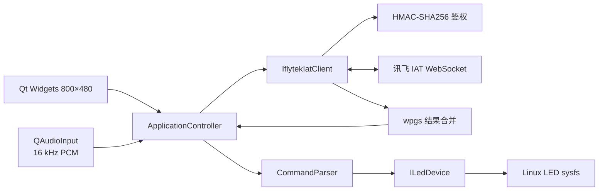

# 架构设计

## 目标

工程把云服务、业务规则和板级 I/O 分离，使同一套界面与业务逻辑既能在 PC 演示，也能在 i.MX6ULL 上连接真实麦克风、讯飞服务和 LED。所有对象运行在 Qt 事件循环中，当前版本没有阻塞 UI 线程的轮询。

## 模块职责

| 模块 | 职责 | 可替换点 |
|---|---|---|
| `PcmAudioCapture` | 选择 ALSA/Qt 音频输入，严格校验 16 kHz、16 bit、单声道，计算音量 | 可替换为直接 ALSA 或自定义驱动 |
| `IflytekAuth` | RFC1123 时间、HMAC-SHA256 签名、鉴权 URL | 可单元测试，不依赖网络 |
| `IflytekIatClient` | WebSocket 生命周期、40 ms 音频帧、状态 0/1/2、超时收尾 | 可替换云厂商实现 |
| `IatResultParser` | 解析 `ws/cw`，处理 `pgs=rpl` 的动态修正 | 独立单元测试 |
| `CommandParser` | 从识别文本提取 LED 开/关/切换意图 | 后续可升级为配置驱动或 NLU |
| `ILedDevice` / `SysfsLedDevice` | 板级设备抽象与 sysfs 实现 | 可增加蜂鸣器、继电器、GPIO 字符设备 |
| `ApplicationController` | 协调 UI、音频、云端和硬件，限制单次 60 秒 | 后续可迁移到工作线程 |

## 关键状态

`Idle → Connecting → Streaming → Finishing → Finished`。网络、TLS、协议或录音错误进入 `Error`；用户再次开始时会重置音频缓存和动态修正结果。

## 安全边界

- AppID/APIKey/APISecret 不进入源码，环境变量优先于 INI。
- TLS 证书错误不会被忽略；板端应安装 CA 证书并校准系统 UTC 时间。
- 日志只记录主机名和会话 SID，不打印鉴权 URL 或密钥。
- sysfs 写操作局限于配置的 LED 节点。

